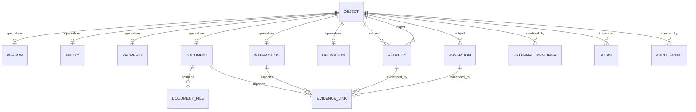
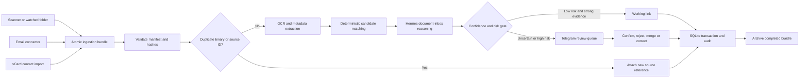

# Day-One MVP for a Personal Reverse-CRM

> **Research roadmap, not the implemented first-slice contract.** The shipped scope is governed
> by [`docs/frozen-mission.md`](docs/frozen-mission.md). Hermes, Telegram, email sync, obligations,
> and model-driven extraction described below are possible later integrations and are explicitly
> excluded from the current implementation.

## Executive summary

A personal reverse-CRM should be defined as a **household-controlled relationship and evidence system**: a private register of people, organisations, contacts, properties, assets, accounts and obligations, linked to the documents and interactions that support what the household believes about them. The concept extends Harvard Project VRM’s long-standing idea that individuals need tools reciprocal to vendor-owned CRM, while borrowing the useful people-and-relationship orientation of personal CRM systems such as Monica. Project VRM describes VRM as tools that help individuals manage relationships with vendors; Monica demonstrates the practical value of modelling contacts, relationships, activities, reminders and obligations from the individual’s perspective. citeturn0search0turn0search24turn0search1turn0search25

The Day-One MVP should **not** attempt to construct a universal household knowledge graph, import an entire lifetime of email, or turn every OCR token into a record. Its purpose is narrower:

> Given a scanned document, email or contact, identify the most likely relevant people, organisations and properties; preserve the underlying evidence; propose structured relationships; and allow a household member to confirm or reject them quickly.

The recommended architecture is:

```text
Original files and attachments
        ↓
Content-addressed local evidence store
        ↓
SQLite metadata, relationships, assertions and audit log
        ↓
Deterministic matching and bounded candidate generation
        ↓
Hermes document-inbox profile for contextual reasoning
        ↓
Telegram review for uncertain or consequential changes
```

SQLite is the recommended default because it is embedded, transactional, serverless and well suited to application-file and record-keeping use cases. It supports strict tables, partial and unique indexes, JSON functions, FTS5 search, atomic transactions, WAL concurrency and online backups without introducing a database service. citeturn1search1turn1search2turn1search10turn12search0turn12search2turn12search3turn7search2 A graph database should be deferred: the Day-One graph is small, its traversals are shallow, and a previously attractive embedded option, Kùzu, was archived in October 2025, illustrating the additional lifecycle risk of adopting a specialised graph engine too early. citeturn3view2

The system should pass three mandatory domain tests before it is considered useful:

| Anchor case | Required Day-One result |
|---|---|
| Major-purchase receipt | Recognise that the document is a receipt, canonicalise the merchant, extract date and amount, propose or match an asset, and retain the receipt as purchase and warranty evidence. |
| Rental-property bill | Identify the service address or account reference, distinguish it from the principal residence, and link the bill to the correct rental property and provider. |
| Mortgage document | Identify the lender, borrowers named in the document, loan/account identifier and likely secured property, while treating ownership, liability and legal effect as proposals unless explicitly evidenced. |

The most important safety rule is that **documents are evidence; model outputs are assertions**. A model may propose that an electricity bill concerns a rental property, but the proposition must retain its source, extraction method, confidence and review status. Legal ownership, tax treatment, medical information, identity relationships and financial liabilities should never become confirmed merely because a model produced a high confidence score.

The Day-One deployment should use a dedicated Hermes profile with a narrow tool surface. Hermes profiles have separate configuration, memory, sessions, skills and gateway state; Hermes can expose the profile through an OpenAI-compatible API and can connect to a deliberately filtered external lookup service through MCP or a plugin. citeturn9search17turn0search3turn9search1turn9search5turn9search21 Hermes’ durable memory should contain only operational policy, not the household database. The authoritative data should remain in SQLite behind explicit tools such as `household_lookup`, `household_propose_fact` and `household_review_queue`.

The recommended first four sprints deliver, in order: the evidence store and schema; scan/email/contact ingestion; deterministic matching and review; then Hermes integration, hardening and acceptance testing. The resulting MVP should remain comfortably below 100,000 database rows under ordinary household use because it stores canonical records and bounded assertions rather than every extracted token, every model candidate or every transient email feature.

## Product boundary and success criteria

**Planning assumptions.** No household size or document-volume constraint was supplied. For sizing and testing only, this report assumes two to eight household members, one to five real properties, fewer than 1,000 enduring external organisations and contacts, and approximately 50–500 incoming documents or relevant emails per month. These are design assumptions, not product limits. The architecture remains suitable above those levels, but the MVP deliberately optimises for a single household rather than multi-tenant or enterprise workloads.

**Product goal.** The MVP should answer five classes of question reliably:

| Question | Example |
|---|---|
| What is this evidence? | “This is a council rates notice dated 15 July 2026.” |
| Who or what is it relevant to? | “It concerns the Newcastle rental property and the local council.” |
| What existing record does it match? | “The merchant matches the canonical JB Hi-Fi organisation; the serial number matches the scanner asset.” |
| What obligation or event does it create? | “Payment is due on 14 August 2026.” |
| Why does the system believe that? | “The service address, account suffix and bill issuer all match previously confirmed evidence.” |

This orientation is deliberately broader than a personal CRM focused solely on people. Monica’s model shows the usefulness of recording relationships, interactions, reminders, tasks and debts around contacts, but the reverse-CRM must also treat organisations, assets, real properties, accounts and documents as first-class objects. citeturn0search5turn0search17turn0search25

**MVP goals.** The first release should provide a canonical household register; immutable or append-only evidence references; deterministic candidate matching; model-assisted classification; a bounded review queue; provenance-aware promotion; and useful lookup through CLI, API, Hermes and Telegram. It should support scanned PDFs and images, email messages and attachments, and vCard contact imports. vCard is an appropriate interchange format because RFC 6350 standardises representation of people and other entities, including names, addresses, email addresses and telephone numbers. citeturn4search2turn4search6

The first release should explicitly exclude automatic tax deductibility decisions, legal interpretation of mortgage or tenancy documents, automatic deletion of original files, whole-mailbox semantic indexing, autonomous outbound communication with vendors, and unrestricted model write access.

**Success criteria.** These targets should be evaluated against a small, household-specific gold set rather than an abstract benchmark.

| Measure | Day-One target | Test method |
|---|---:|---|
| Anchor-document recognition | At least 90% correct class in the top suggestion | Minimum 30 labelled samples spanning major purchases, rental bills and mortgage documents |
| Relevant-object retrieval | Correct person, organisation or property in top three candidates for at least 90% of anchor samples | Compare ranked candidates with confirmed labels |
| High-confidence automatic links | Precision of at least 98%; no high-risk relationship automatically confirmed | Audit all auto-linked results during pilot |
| Duplicate binary detection | 100% for byte-identical attachments | Re-ingest identical files under different names |
| Near-duplicate receipt flagging | At least 90% recall for rescans and forwarded copies in the test set | Scan the same receipts at different resolutions and ingest email copies |
| Review efficiency | Median under 30 seconds per uncertain item | Telegram interaction timing |
| Explainability | Every proposed or working relationship has at least one provenance record | Database constraint and audit query |
| Auditability | Every confirmation, rejection, merge and deletion is attributable and timestamped | Append-only audit verification |
| Storage discipline | Under 250 MB of database metadata after six months at the assumed volume, excluding original evidence files | Synthetic load and `sqlite3_analyzer` |
| Queue hygiene | Fewer than 100 unresolved ordinary proposals and no proposal older than its configured TTL without escalation | Scheduled maintenance query |
| Recovery | Restore database and evidence catalogue from backup in under one hour | Quarterly restore drill |
| Hermes containment | Hermes can read and propose but cannot directly delete evidence or confirm high-risk facts | Tool-permission test |

The 90% matching targets are acceptance thresholds, not claims about expected model accuracy. The system should be judged more harshly for false confirmation than for asking a user to review an uncertain item.

**Anti-bloat guardrails.** The MVP should impose explicit cardinality limits:

| Object | Guardrail |
|---|---|
| Candidate links per ingestion item | Retain top 10 during processing; persist at most top 3 unless reviewed |
| Evidence links per assertion | Retain the strongest 5 structured links; additional raw evidence remains discoverable through the source document |
| OCR text | One canonical sidecar per document version, not one row per word or page token |
| Model traces | Retain final structured output and compact diagnostics; discard hidden chain-of-thought and verbose intermediate generations |
| Email history | Import a recent rolling window or labelled folders first; backfill older threads on demand |
| Pending ordinary proposals | TTL of 90 days, then summarise, archive or expire |
| Low-value interactions | Aggregate recurring machine-generated notices after extraction of obligations and evidence |
| Duplicate attachments | One binary object per SHA-256; many source references may point to it |
| Entity aliases | Keep aliases that have matched evidence or were user-confirmed; expire unused speculative aliases |

The correct mental model is not “save everything the model notices”. It is “preserve source evidence, canonical records and the minimum assertions required to make retrieval and future matching better”.

## Core information model

A relational model with a shared `object` supertype provides graph-like flexibility while preserving SQLite foreign keys and clear subtype constraints. The `object` table supplies stable IDs for everything that can participate in a relationship. Subtype tables contain domain-specific fields. `relation` connects objects; `assertion` stores scalar claims; and `evidence_link` records why either exists.



The term **entity** below means an external organisation, agency, business, trust, service provider or unresolved external contact. A human contact who is known as an individual belongs in `person`; a role such as “property manager at Example Realty” is expressed as a relation between the person and organisation. This avoids duplicating the same individual as both a person and a contact.

### Minimal schema

| Table | Essential fields and SQLite types | Required indexes and constraints | Example |
|---|---|---|---|
| `object` | `id TEXT PK`; `kind TEXT`; `label TEXT`; `lifecycle_status TEXT`; `created_at TEXT`; `updated_at TEXT`; `merged_into_id TEXT NULL FK`; `metadata_json TEXT` | `CHECK kind IN (...)`; index `(kind, lifecycle_status)`; index on normalised label; `json_valid(metadata_json)` | `obj_prop_newcastle`, `property`, `Newcastle rental unit`, `active` |
| `person` | `object_id TEXT PK/FK`; `given_name TEXT`; `family_name TEXT`; `preferred_name TEXT`; `household_role TEXT NULL`; `sensitivity TEXT` | Index on normalised family and preferred names; no DOB required for MVP | Household member “Alex Chen” |
| `entity` | `object_id TEXT PK/FK`; `entity_type TEXT`; `canonical_name TEXT`; `abn_acn TEXT NULL`; `domain TEXT NULL`; `country_code TEXT NULL` | Unique partial indexes for non-null ABN/ACN and canonical domain; index on normalised canonical name | Commonwealth Bank of Australia, lender |
| `property` | `object_id TEXT PK/FK`; `property_type TEXT`; `make TEXT NULL`; `model TEXT NULL`; `serial_or_vin TEXT NULL`; `address_normalised TEXT NULL`; `acquired_on TEXT NULL`; `disposed_on TEXT NULL` | Unique partial index on serial/VIN; index on address; index `(make, model)` | Real property, scanner, laptop, appliance |
| `document` | `object_id TEXT PK/FK`; `document_type TEXT`; `document_date TEXT NULL`; `issuer_id TEXT NULL FK`; `currency TEXT NULL`; `amount_minor INTEGER NULL`; `account_suffix TEXT NULL`; `ocr_text TEXT NULL`; `ingest_status TEXT`; `source_channel TEXT` | Index `(document_type, document_date)`; `(issuer_id, document_date)`; `(amount_minor, document_date)`; FTS5 external-content index over OCR/title; no binary BLOB | Receipt, electricity bill, mortgage statement |
| `document_file` | `id TEXT PK`; `document_id TEXT FK`; `sha256 TEXT`; `byte_size INTEGER`; `mime_type TEXT`; `relative_path TEXT`; `role TEXT`; `perceptual_hash TEXT NULL`; `created_at TEXT` | Unique `sha256`; index `document_id`; unique `(document_id, role, sha256)` | Original PDF, preview PNG, OCR sidecar |
| `interaction` | `object_id TEXT PK/FK`; `channel TEXT`; `occurred_at TEXT`; `direction TEXT`; `thread_key TEXT NULL`; `summary TEXT`; `raw_source_ref TEXT NULL` | Unique source-specific message identity; index `(thread_key, occurred_at)`; index `(channel, occurred_at)` | Email from lender, phone call note, Telegram confirmation |
| `obligation` | `object_id TEXT PK/FK`; `obligation_type TEXT`; `due_at TEXT NULL`; `amount_minor INTEGER NULL`; `currency TEXT NULL`; `state TEXT`; `responsible_object_id TEXT NULL FK`; `source_document_id TEXT NULL FK` | Index `(state, due_at)`; index `responsible_object_id`; `CHECK state IN (...)` | Bill payment due, warranty expiry, document follow-up |
| `relation` | `id TEXT PK`; `subject_id TEXT FK`; `predicate TEXT`; `object_id TEXT FK`; `status TEXT`; `confidence REAL`; `valid_from TEXT NULL`; `valid_to TEXT NULL`; `risk_class TEXT`; `created_by TEXT` | Unique active `(subject_id,predicate,object_id)`; indexes on subject and object; confidence check `0–1`; status check | Bill `relevant_to` rental property |
| `assertion` | `id TEXT PK`; `subject_id TEXT FK`; `predicate TEXT`; `value_text TEXT NULL`; `value_num REAL NULL`; `value_date TEXT NULL`; `value_json TEXT NULL`; `status TEXT`; `confidence REAL`; `risk_class TEXT`; `supersedes_id TEXT NULL FK` | Index `(subject_id,predicate,status)`; one typed value check; JSON validity; no destructive overwrite | Asset warranty ends 2028-07-15 |
| `evidence_link` | `id TEXT PK`; `target_type TEXT`; `target_id TEXT`; `source_object_id TEXT FK`; `locator TEXT NULL`; `extractor TEXT`; `excerpt_hash TEXT NULL`; `weight REAL`; `created_at TEXT` | Index `(target_type,target_id)`; index `source_object_id`; uniqueness over target/source/locator | Page 1 service address supports property match |
| `alias` | `id TEXT PK`; `object_id TEXT FK`; `alias_text TEXT`; `alias_normalised TEXT`; `alias_type TEXT`; `status TEXT`; `use_count INTEGER`; `last_used_at TEXT` | Index `alias_normalised`; unique `(object_id,alias_normalised,alias_type)` | “CBA”, “Commonwealth Bank”, merchant descriptor |
| `external_identifier` | `id TEXT PK`; `object_id TEXT FK`; `scheme TEXT`; `value TEXT`; `issuer TEXT NULL`; `status TEXT` | Unique `(scheme,value)` where globally unique; index `(object_id,scheme)` | ABN, email address, account suffix, IMAP identity |
| `audit_event` | `id TEXT PK`; `occurred_at TEXT`; `actor_type TEXT`; `actor_id TEXT`; `action TEXT`; `object_id TEXT NULL FK`; `before_json TEXT NULL`; `after_json TEXT NULL`; `correlation_id TEXT`; `prev_event_hash TEXT NULL`; `event_hash TEXT` | Index `(object_id,occurred_at)`; `(correlation_id,occurred_at)`; append-only application policy | User confirmed a receipt-to-asset link |

Use SQLite `STRICT` tables so insertion of incompatible values fails rather than silently relying on SQLite’s normal dynamic typing. SQLite’s strict mode retains normal foreign keys, uniqueness checks and indexes while enforcing declared storage types. citeturn12search0 Use JSON only for sparse, non-index-critical metadata; frequently queried values such as dates, amounts, account suffixes and identifiers belong in typed columns. SQLite’s JSON support stores JSON in ordinary TEXT or BLOB values and offers validation and extraction functions, but that flexibility should not become a substitute for a stable schema. citeturn12search2

`status` should use exactly three epistemic states:

| State | Meaning | May affect automated action? |
|---|---|---|
| `proposed` | Produced by one ingestion, heuristic or model inference and not yet corroborated | Candidate ranking only |
| `working` | Supported by repeated independent evidence or a low-risk deterministic match, but not explicitly confirmed | Reversible tagging and lookup ordering |
| `confirmed` | Explicitly confirmed by an authorised person or established by authoritative evidence under a rule approved by the household | Yes, within the relationship’s risk class |

Lifecycle state such as `active`, `archived`, `merged` or `deleted` is different from epistemic status and should be stored separately.

### Representative records

**Major-purchase receipt and asset**

```json
{
  "document": {
    "id": "doc_01J9R",
    "document_type": "purchase_receipt",
    "document_date": "2026-07-18",
    "issuer_id": "org_jbhifi",
    "currency": "AUD",
    "amount_minor": 69900,
    "source_channel": "scanner"
  },
  "property": {
    "id": "asset_epson_es60w",
    "property_type": "scanner",
    "make": "Epson",
    "model": "ES-60W",
    "serial_or_vin": "X8M2..."
  },
  "relation": {
    "subject_id": "doc_01J9R",
    "predicate": "purchase_evidence_for",
    "object_id": "asset_epson_es60w",
    "status": "working",
    "confidence": 0.94
  }
}
```

**Rental-property utility bill**

```json
{
  "document": {
    "id": "doc_01J9S",
    "document_type": "electricity_bill",
    "document_date": "2026-07-21",
    "issuer_id": "org_energy_provider",
    "account_suffix": "4821",
    "amount_minor": 18342
  },
  "relation": {
    "subject_id": "doc_01J9S",
    "predicate": "relevant_to",
    "object_id": "prop_newcastle_rental",
    "status": "confirmed",
    "confidence": 1.0
  },
  "evidence": [
    "service address exact match",
    "account suffix previously confirmed for property"
  ]
}
```

**Mortgage document**

```json
{
  "document": {
    "id": "doc_01J9T",
    "document_type": "mortgage_statement",
    "document_date": "2026-07-31",
    "issuer_id": "org_lender",
    "account_suffix": "7784"
  },
  "relations": [
    {
      "predicate": "concerns_property",
      "object_id": "prop_primary_home",
      "status": "working",
      "confidence": 0.89,
      "risk_class": "high"
    },
    {
      "predicate": "names_person",
      "object_id": "person_alex",
      "status": "proposed",
      "confidence": 0.97,
      "risk_class": "high"
    }
  ]
}
```

The second mortgage relation remains proposed despite strong name extraction because “named in a document”, “borrower”, “owner” and “person legally liable” are different predicates. The data model must prevent those concepts from collapsing into one generic association.

## Storage and retrieval architecture

### Storage alternatives

| Choice | Strengths | Weaknesses | Appropriate role | Day-One verdict |
|---|---|---|---|---|
| JSON or JSONL files | Transparent; easy to inspect, version and export; no database dependency; good for atomic ingestion bundles | Cross-record integrity is manual; concurrent updates are awkward; deduplication and indexes must be rebuilt; merges and audit queries become fragile; graph traversal requires application scans | Interchange, backups, test fixtures and exported records | Do not use as authoritative mutable store |
| SQLite plus filesystem | Serverless; one transactional database file; foreign keys, indexes, FTS5, strict tables, JSON fields, atomic commit and online backup; excellent Python support | One writer at a time; remote filesystem locking can be unsafe; schema migrations require discipline; binaries should remain outside the DB | Canonical metadata, relationships, provenance, obligations and audit log | Recommended default |
| Embedded graph database | Natural relationship traversal; Cypher-style queries; useful when graph depth and path discovery dominate | Extra runtime and operational model; weaker ecosystem for ordinary household CRUD; harder migrations and exports; product-lifecycle risk; unnecessary for shallow Day-One traversals | Later analytical projection or specialised relationship exploration | Defer until measured need |
| Client/server graph or relational DB | Multi-user concurrency, network access, richer operations | Service administration, credentials, patching, backup and network exposure are disproportionate for one household | Future multi-household or high-concurrency deployment | Out of scope |

SQLite’s maintainers identify record-keeping applications and application file formats as appropriate uses, and its in-process design removes the need for a separate server. citeturn1search1turn1search4turn12search7 WAL mode allows readers and a writer to proceed concurrently, although it introduces adjacent `-wal` and `-shm` files that must remain on a local filesystem and be included in operational planning. citeturn1search10turn1search12

The recommendation is therefore:

```text
/var/lib/reversecrm/
├── reversecrm.sqlite3
├── evidence/
│   └── sha256/
│       └── ab/
│           └── abcdef...              immutable original
├── derivatives/
│   └── abcdef.../
│       ├── searchable.pdf
│       ├── ocr.txt
│       └── page-001-preview.webp
├── bundles/
│   ├── ready/
│   ├── processing/
│   ├── complete/
│   └── failed/
└── backups/
```

Evidence should be addressed by SHA-256 rather than by the user-visible filename. Python’s standard `hashlib` module provides secure hash functions including SHA-256, and a unique index on the digest makes byte-identical deduplication deterministic. citeturn11view2 Original names, email attachment names and scanner names remain source metadata, not storage identities.

Do not store large PDF and image BLOBs in SQLite on Day One. Keeping binaries in a content-addressed evidence directory permits streaming, ordinary filesystem backup tools and immutable access permissions, while SQLite maintains the referential catalogue. The database and evidence directory must still be backed up as one logical set.

**Recommended SQLite configuration**

```sql
PRAGMA foreign_keys = ON;
PRAGMA journal_mode = WAL;
PRAGMA synchronous = FULL;
PRAGMA busy_timeout = 5000;
PRAGMA trusted_schema = OFF;
```

`FULL` synchronous mode prioritises durability over marginal ingestion speed. The expected workload is small enough that there is no reason to trade power-loss safety for throughput. Each complete ingestion should run inside one explicit transaction so that document metadata, files, relations, provenance and audit events either commit together or not at all. SQLite defines atomic commit as all changes in a transaction occurring or none occurring, including recovery from interruption under its supported journalling modes. citeturn1search2

Use FTS5 for OCR, document titles and interaction summaries, but not as the canonical matching mechanism for identifiers. Full-text search should help answer “find the plumber’s invoice about the hot-water system”; exact indexes should answer “find account suffix 4821”. Hermes itself uses SQLite and FTS5 for session metadata and search, which is evidence that this operational pattern is compatible with its deployment ecosystem. citeturn9search20

A graph database should be reconsidered only when real queries repeatedly require paths of depth greater than roughly three, graph-wide centrality or clustering, large-scale relationship analytics, or cross-household isolation. Even then, a safer migration is to project SQLite objects and relations into a graph index while retaining SQLite as the system of record.

## Ingestion and matching

### Ingestion architecture



**Scanner and OCR.** Tesseract is a command-line and API-accessible open-source OCR engine. OCRmyPDF wraps Tesseract to add searchable text layers to scanned PDFs and can produce a sidecar text file suitable for indexing. citeturn5search0turn5search9turn6search1turn6search2 OCRmyPDF can rotate, deskew and clean scans, but its documentation warns that image processing may remove desirable content or introduce artefacts; the original scan must therefore remain immutable and reviewable. citeturn6search0

A practical OCR command is:

```bash
ocrmypdf \
  --rotate-pages \
  --deskew \
  --skip-text \
  --sidecar bundle/ocr.txt \
  bundle/source.pdf \
  bundle/searchable.pdf
```

Treat PDFs from email as hostile input. OCRmyPDF states that it is not designed to protect against malicious PDFs, so email-derived files should be processed as an unprivileged user in a container or other sandbox with no network access, resource limits and a read-only input mount. citeturn6search8turn6search12

**Email ingestion.** The connector should preserve the raw RFC message or an export reference, its `Message-ID`, sender and recipient addresses, received date, subject, attachment digests and provider-specific identity. RFC 5322 specifies that `In-Reply-To` and `References` carry message identifiers used to represent reply ancestry and threads, so these headers should outrank subject-prefix heuristics. citeturn4search1 For generic IMAP synchronisation, persist mailbox identity plus `UIDVALIDITY` and UID rather than sequence numbers; the IMAP specification defines UIDs in conjunction with UID validity so that messages can be tracked across sessions. citeturn10search1

The Day-One email policy should be selective:

```text
Include:
  household-admin labels or folders
  messages with PDF/image attachments
  known lenders, utilities, councils, insurers and property managers
  messages explicitly forwarded to an ingestion address

Exclude by default:
  newsletters
  social notifications
  bulk promotions
  mailing lists
  historical whole-mailbox backfill
```

**Contact import.** Import vCard `FN`, structured `N`, `ORG`, `EMAIL`, `TEL`, `ADR`, `UID` and categories, preserving source IDs and raw vCards. RFC 6350 allows vCards to represent individuals and other entities, but import should not automatically merge two records merely because their display names match. citeturn4search2turn4search6 Email and telephone exact matches are strong merge candidates; names alone are not.

### Watcher and bundle pattern

A watcher is a trigger, not the source of truth. Linux inotify can report create, close-write and rename events, but its queue may overflow, events may be coalesced, remote network-filesystem changes may not be observed, and rename pairs are not inserted atomically. Robust software must therefore reconcile the directory periodically rather than assuming every event was delivered. citeturn11view1

The producer should write a private temporary directory, fsync completed files, write the manifest last, and atomically rename the directory or marker on the same filesystem. Python’s `Path.replace()` and `os.replace()` use the platform rename operation; successful same-filesystem replacement is atomic. citeturn5search5turn5search8

```text
01J9R8SCANNER4Z8/
├── manifest.json
├── source.pdf
├── searchable.pdf
├── ocr.txt
├── preview-001.webp
└── READY
```

Example manifest:

```json
{
  "schema_version": 1,
  "job_id": "01J9R8SCANNER4Z8",
  "created_at": "2026-08-01T20:15:00+10:00",
  "source": {
    "channel": "scanner",
    "collector": "es60w-lab"
  },
  "files": [
    {
      "role": "original",
      "path": "source.pdf",
      "sha256": "ab42...",
      "mime_type": "application/pdf",
      "bytes": 1842301
    },
    {
      "role": "ocr_sidecar",
      "path": "ocr.txt",
      "sha256": "99ac...",
      "mime_type": "text/plain",
      "bytes": 7431
    }
  ]
}
```

The consumer should claim work by atomically moving the bundle from `ready` to `processing`. A stale-processing recovery job can return bundles whose lease has expired.

Suggested CLI:

```bash
reversecrm ingest bundle /srv/reversecrm/bundles/ready/01J9R8SCANNER4Z8
reversecrm ingest email --mailbox Household --since 2026-05-01
reversecrm import contacts ~/Exports/contacts.vcf
reversecrm review list --status proposed
reversecrm lookup "latest mortgage statement for Newcastle rental"
```

### Lightweight matching algorithms

Matching should be a cascade. Cheap exact rules reduce the candidate set; fuzzy and model-based methods operate only on that set.

```python
def rank_relevance(extracted, candidate):
    score = 0.0
    evidence = []

    if extracted.abn and extracted.abn == candidate.abn:
        score += 1.00
        evidence.append("exact_abn")

    if extracted.email_domain == candidate.domain:
        score += 0.50
        evidence.append("email_domain")

    if extracted.account_suffix in candidate.confirmed_account_suffixes:
        score += 0.85
        evidence.append("account_suffix")

    if normalise_address(extracted.service_address) == candidate.address:
        score += 0.90
        evidence.append("service_address")

    score += 0.35 * fuzzy_name_score(
        normalise_name(extracted.vendor_name),
        candidate.aliases,
    )

    if abs_days(extracted.date, candidate.expected_date) <= 5:
        score += 0.10
        evidence.append("date_window")

    if extracted.amount_minor in candidate.recent_amounts:
        score += 0.15
        evidence.append("amount_match")

    return min(score, 1.0), evidence
```

RapidFuzz provides optimised string similarity metrics and candidate-extraction functions suitable for fuzzy matching after normalisation. citeturn4search0turn4search12 It should not be run blindly against every record. Candidate blocking by entity type, domain, postcode, address token, first letter or known merchant category keeps both latency and false positives low.

| Method | Use | Complexity | Persistence policy |
|---|---|---:|---|
| SHA-256 binary hash | Exact duplicate attachment or scan | `O(B)` over file bytes; indexed lookup approximately `O(log n)` | Persist digest permanently |
| Source identity | Same IMAP message, provider message or contact UID | `O(1)` indexed lookup | Persist permanently |
| Exact stable identifiers | ABN/ACN, serial number, email address, account reference | `O(log n)` | Confirm only under scheme-specific rules |
| Normalised exact name/alias | Known merchant or person spelling | `O(k + log n)` | Increment alias use count |
| Fuzzy name score | OCR spelling variation and merchant descriptors | `O(c × L²)` worst case for `c` blocked candidates and string length `L` | Persist top candidates only |
| Address-token match | Rental bill or mortgage-property association | Approximately `O(c × t)` | Store matched normalised address evidence |
| Date and amount heuristic | Join receipt email, statement and payment | `O(c)` after date-range index | Never sufficient alone for confirmation |
| SimHash or text sketch | Near-duplicate OCR text | `O(T)` to construct for `T` tokens; bounded Hamming search | Persist one compact fingerprint |
| RFC header threading | Group replies and forwarded administrative conversation | `O(r)` for number of reference IDs | Persist thread key and message ancestry |
| Attachment hash | Link email attachment to scanned copy | `O(B)` once, then indexed lookup | Strong evidence, not necessarily same document role |

Exact file hashing detects identical copies, while OCR rescans require a near-duplicate technique. A compact SimHash-style fingerprint can preserve similarity of token vectors and be compared by Hamming distance; the foundational locality-sensitive hashing work describes similarity-preserving sketches, while later near-duplicate systems use such compact signatures to reduce comparison cost. citeturn4search3turn4search23 Day One does not need a large LSH index: bucket a 64-bit fingerprint by several fixed bands and examine only matching buckets.

Vendor canonicalisation should use this order:

```text
ABN/ACN or known legal identifier
→ exact sender domain or verified email
→ confirmed merchant descriptor alias
→ exact normalised name
→ blocked fuzzy alias match
→ model proposal
```

Normalisation may remove legal suffixes such as “Pty Ltd” for comparison, but the legal name must remain unchanged in the source field. Australian merchant terminals often emit abbreviated descriptors, so aliases should distinguish `legal_name`, `trading_name`, `card_descriptor`, `email_sender` and `ocr_variant`.

Receipt fingerprinting should combine:

```text
binary SHA-256
+ normalised merchant
+ transaction date
+ rounded or exact amount
+ last four digits of receipt/order/account reference
+ OCR text sketch
```

A receipt should be considered an exact logical duplicate only when a strong identifier or attachment hash matches. Merchant/date/amount similarity alone should produce a near-duplicate warning because two genuine transactions may share those values.

### Collector invocation

Hermes’ API server exposes an OpenAI-compatible endpoint and creates an agent using that profile’s configured model, tools, memory and skills. citeturn0search3turn0search11 A minimal collector should send OCR text and one representative image only after deterministic ingestion and candidate generation:

```python
from __future__ import annotations

import base64
import json
import os
import urllib.request
from pathlib import Path


def ask_hermes(image: Path, ocr: Path, candidates: list[dict]) -> dict:
    payload = {
        "model": "document-inbox",
        "temperature": 0,
        "messages": [{
            "role": "user",
            "content": [
                {
                    "type": "image_url",
                    "image_url": {
                        "url": "data:image/png;base64,"
                               + base64.b64encode(image.read_bytes()).decode()
                    }
                },
                {
                    "type": "text",
                    "text": json.dumps({
                        "task": "classify_and_rank_relevance",
                        "ocr_text": ocr.read_text(errors="replace")[:40000],
                        "candidates": candidates[:10],
                        "required_output": "JSON only"
                    })
                }
            ]
        }]
    }

    req = urllib.request.Request(
        os.environ["HERMES_DOCUMENT_URL"],
        data=json.dumps(payload).encode(),
        headers={
            "Authorization": f"Bearer {os.environ['HERMES_DOCUMENT_KEY']}",
            "Content-Type": "application/json",
        },
    )

    with urllib.request.urlopen(req, timeout=180) as response:
        body = json.load(response)

    return json.loads(body["choices"][0]["message"]["content"])
```

Hermes vision sends images as base64 content blocks to a vision-capable model. citeturn9search6 For multi-page documents, send a contact sheet or only pages selected by deterministic signals; do not base64 every page without a reason. The original PDF remains in the evidence store and can be examined through a narrowly scoped tool when needed.

A remote Hermes CLI is not required in the collector image. The supported API is the cleaner production boundary. An SSH command such as `ssh hermes document-inbox chat ...` is acceptable for diagnostics, but it couples the collector to shell credentials, quoting and a shared filesystem. Hermes also supports an SSH terminal backend, but that controls where Hermes executes commands; it is not a substitute for an authenticated ingestion API. citeturn9search10

## Trust, review and lifecycle management

### Provenance and promotion

Every relation and assertion must answer:

```text
Who or what produced it?
Which source supports it?
Where in that source is the support?
Was it extracted, inferred or user-stated?
What was its status at creation?
Who promoted or rejected it?
What did it supersede?
```

Confidence and status must remain separate. Confidence describes the matcher’s belief; status describes the system’s authority to use the claim.

A conservative promotion function is:

```python
HIGH_RISK = {
    "owns",
    "is_borrower",
    "is_tenant",
    "tax_deductible_for",
    "has_medical_condition",
    "legal_representative_of",
}

def promotion_target(assertion, evidence, reviewer=None):
    if assertion.predicate in HIGH_RISK:
        return "confirmed" if reviewer and reviewer.explicitly_confirmed else "proposed"

    if reviewer and reviewer.explicitly_confirmed:
        return "confirmed"

    if evidence.has_verified_identifier and evidence.sources_independent >= 1:
        return "working"

    if (
        evidence.sources_independent >= 2
        and evidence.max_confidence >= 0.90
        and not evidence.has_contradiction
    ):
        return "working"

    return "proposed"
```

Recommended promotion rules are:

| Evidence pattern | Result |
|---|---|
| Explicit authorised statement: “This bill is for the Newcastle rental” | Confirmed relationship, with interaction as evidence |
| Exact SHA-256 attachment already attached to a confirmed document | Same binary object; new source reference confirmed |
| Exact verified ABN or serial number | Working or confirmed according to identifier policy |
| Repeated matching service address and account suffix across independent bills | Working property relevance |
| Model inference from one ambiguous scan | Proposed |
| Strong model confidence without structured evidence | Proposed |
| Contradictory confirmed claims | Neither silently replaced; create contradiction review |
| Sensitive or legally consequential claim | Explicit human confirmation required |
| User correction | New confirmed assertion superseding the old; old assertion retained as rejected or superseded |

“Independent evidence” must not mean two model runs over the same OCR text. It means distinct sources or distinct stable features, such as a bill’s service address plus a previously confirmed account reference.

Audit events should be append-only at the application layer. A hash chain over canonical event payloads offers basic tamper evidence, although it is not a substitute for protected backups or external logs. Events should include a correlation ID tying together ingestion, model invocation, review and final write.

### Telegram review experience

Hermes’ Telegram integration supports text, images and file attachments and can restrict access through allowlists or pairing. citeturn9search3turn9search7turn9search13turn9search16 The review interaction should be designed around evidence and one decision, not a long conversational investigation.

**Major purchase**

```text
Hermes:
Receipt recognised: Epson ES-60W scanner
Merchant: JB Hi-Fi
Date: 18 July 2026
Amount: A$699.00

Likely relevance:
  1. Existing asset “Epson ES-60W scanner” — 94%
  2. New household asset — 71%

Evidence:
• Merchant and model appear in OCR
• Serial number matches the existing asset
• Amount matches the order email

Choose:
[Confirm existing asset] [Create new asset] [Not relevant] [Inspect]
```

**Rental-property bill**

```text
Hermes:
Electricity bill from Example Energy
Due: 14 August 2026
Amount: A$183.42

Proposed property:
Newcastle rental unit — 97%

Evidence:
• Exact service-address match
• Account ending 4821 was previously confirmed for this property

[Confirm and create obligation] [Wrong property] [Bill already paid] [Inspect]
```

**Mortgage document**

```text
Hermes:
Mortgage statement from Example Bank

Proposed:
• Concerns primary residence — 89%
• Names Alex Chen — 97%
• Indicates Alex is a borrower — not confirmed

Mortgage and ownership relationships are high-risk.
[Confirm property only] [Review all fields] [Reject] [Inspect document]
```

Telegram should never expose highly sensitive document previews to an unauthorised group chat. Review messages should default to minimal excerpts and require an explicit “Inspect” action for the original or redacted preview.

### Scaling and pruning without information loss

The primary anti-bloat mechanism is **separating evidence retention from working-state retention**. The system may retain original documents for legal, financial or household reasons while pruning generated candidates, stale summaries and redundant extraction data.

| Data class | Retention strategy |
|---|---|
| Original evidence files | Retain according to household policy; deduplicate by hash; never delete automatically in MVP |
| Confirmed assertions and relations | Retain while valid, then close with `valid_to` or supersede |
| Working assertions | Re-evaluate when contradicted or after 12 months without supporting use |
| Ordinary proposed assertions | 90-day TTL; summarise and expire if never reviewed |
| High-risk proposals | Keep until resolved or explicitly dismissed; escalate rather than silently expire |
| Candidate rankings | Persist only selected candidate plus at most two alternatives and scores |
| OCR sidecars | Keep one canonical version per document derivative |
| Model request/response | Keep structured input references, model/version, output and token/runtime diagnostics; drop redundant prose |
| Email bodies | Retain raw message reference or raw EML only for relevant messages; store a compact summary for low-value recurring notices |
| Audit log | Retain; rotate to signed or compressed archive only if necessary |
| FTS index | Rebuildable; exclude archived bulk noise |
| Alias candidates | Expire after six months if never matched or confirmed |

Monthly maintenance should report object counts, dangling evidence links, duplicate aliases, unreviewed proposals, FTS size, largest OCR records, orphan files and database free-page ratio. SQLite supports partial indexes, which are useful for keeping active-queue indexes small—for example, indexing only obligations whose state is open or assertions whose status is proposed. citeturn12search3

Summary records should be derived, not authoritative. For example, the system may maintain a current `organisation_snapshot` saying that a utility serves two properties and has three active accounts, but the snapshot must be rebuildable from confirmed relations.

Avoid embeddings and a vector database on Day One. For household-scale retrieval, exact identifiers, FTS5, aliases, dates, amounts, addresses and shallow graph joins are easier to debug and usually sufficient. Add embeddings only after collecting failed lookup examples that lexical and structured search cannot solve.

## Security, local deployment and Hermes integration

### Local security model

The system contains identity information, financial records, addresses, account references, contact data and potentially medical or legal documents. Its default topology should therefore be:

```text
Scanner / collector VLAN
        │ authenticated HTTPS
        ▼
Reverse-CRM ingestion API
        │ localhost or Unix socket
        ▼
SQLite + evidence filesystem
        │ narrow read/propose API
        ▼
Hermes document-inbox profile
        │ authorised private chat
        ▼
Telegram household reviewer
```

The ingestion and lookup APIs should not bind publicly. Restrict them to localhost, a private VLAN or a private overlay network, and enforce host firewall rules so only named collectors and the Hermes host can connect. API credentials should be separate by client and privilege. OWASP recommends HTTPS for REST services to protect credentials and data in transit, object-level authorisation for endpoints receiving object IDs, and resource limits for expensive operations and uploads. citeturn7search10turn7search22turn7search18

Minimum controls are:

| Control | Day-One implementation |
|---|---|
| API authentication | Random bearer key per collector; key IDs stored in logs, not raw secrets |
| Transport | TLS even on the LAN, or a mutually authenticated private tunnel |
| Authorisation | Separate `ingest`, `lookup`, `propose`, `review` and `admin` capabilities |
| Network | Default-deny host firewall; no router port forwarding; Hermes API exposed only to collector subnet if required |
| Filesystem permissions | Dedicated service account; evidence read-only to Hermes; write access limited to ingestion service |
| Upload limits | Maximum bytes, pages, decompression ratio, OCR duration and concurrent jobs |
| Sandboxing | OCR/PDF processing in an unprivileged container with no network and constrained CPU/memory |
| Secret handling | Environment file readable only by service account, or system credential store; never inside bundle manifests |
| Logging | Redact OCR text, account numbers and bearer tokens; log IDs and hashes |
| Backup | SQLite online snapshot plus evidence-store backup; encrypted off-host copy; tested restore |
| Updates | Pin dependencies and record model, OCR and schema versions |
| Deletion | Two-stage archive and explicit confirmation; no direct Hermes delete tool |

SQLite’s online backup API can create a consistent snapshot of a live database without locking it for the entire copy operation. citeturn7search2turn7search5 Backups must include the evidence store and a manifest of expected digests. A sensible policy is daily local snapshots, weekly encrypted off-host backups and quarterly restore tests.

Encryption at rest can be provided at the volume/filesystem layer, which is simplest for both SQLite and evidence files. SQLCipher is an option when database-file encryption must remain independent of the host volume; it extends SQLite with transparent full-database encryption. citeturn7search1turn7search15 SQLCipher alone does not encrypt PDFs stored outside the database, so volume encryption remains necessary for the complete evidence store. Encryption keys must not reside in the same unprotected backup as the ciphertext.

### Hermes profile design

Hermes profiles are separate home directories containing independent configuration, `SOUL.md`, memories, sessions, skills, cron state and gateway state. This makes a dedicated `document-inbox` or `household-records` profile the correct containment boundary. citeturn9search17

Suggested creation:

```bash
hermes profile create document-inbox
document-inbox setup
document-inbox tools
```

Its tool surface should be smaller than the general household assistant’s:

| Capability | Day-One state |
|---|---|
| Vision | Enabled |
| Household lookup | Enabled, read-only |
| Propose relation/assertion | Enabled |
| Review-queue creation | Enabled |
| Memory | Enabled only for policy and operating instructions |
| File access | Restricted to a read-only evidence export or tool-mediated fetch |
| Web search | Disabled by default |
| General terminal | Disabled |
| Arbitrary SQL | Disabled |
| Document deletion/move | Disabled |
| Confirmation of high-risk facts | Disabled; user action required |
| Messaging | Enabled only for authorised review channel |

Hermes describes its built-in memory as bounded and curated, and external memory providers can inject context and synchronise conversation-derived knowledge. citeturn9search8turn9search4 For this application, automatic mirroring of household records into an external memory provider should be disabled. The profile memory should say only:

```text
The authoritative household register is available through household tools.
Never infer ownership, liability, tax treatment or sensitive relationships
from memory alone. Retrieve current records and cite evidence IDs.
Propose changes; do not confirm high-risk facts.
```

The reverse-CRM itself becomes Hermes’ structured long-term memory. This prevents stale facts from being copied into prompts, preserves provenance and makes corrections reversible.

Hermes supports custom tools through plugins and external tools through MCP. MCP servers can be local or remote and can be filtered so that only selected tools are exposed; Hermes’ own guidance recommends connecting the smallest useful surface rather than everything an MCP server offers. citeturn9search1turn9search5turn9search9turn9search21

A minimal tool API is:

```text
household_lookup(
    query,
    object_kinds = [],
    as_of = null,
    include_proposed = false,
    limit = 10
)

household_get_evidence(
    document_id,
    mode = "metadata|ocr_excerpt|preview"
)

household_propose_relation(
    subject_id,
    predicate,
    object_id,
    confidence,
    evidence_ids,
    rationale_code
)

household_propose_assertion(
    subject_id,
    predicate,
    typed_value,
    confidence,
    evidence_ids
)

household_create_review(
    target_id,
    question,
    choices,
    risk_class
)

household_recent_changes(
    since,
    limit = 50
)
```

`household_lookup` should return compact structured slices, not database dumps:

```json
{
  "query": "Newcastle electricity property",
  "results": [
    {
      "id": "prop_newcastle_rental",
      "kind": "property",
      "label": "Newcastle rental unit",
      "match_reasons": [
        "service address",
        "confirmed electricity account ending 4821"
      ],
      "relevant_relations": [
        {
          "predicate": "serviced_by",
          "object": "Example Energy",
          "status": "confirmed"
        }
      ]
    }
  ]
}
```

Hermes skills use progressive disclosure so procedural guidance is loaded when needed rather than always occupying context. citeturn9search25 The profile should therefore have a small `document-ingest` skill describing classification rules, risk predicates, output schemas and review policy, while `SOUL.md` remains short.

### Day-One test suite

| Test | Input | Expected result |
|---|---|---|
| Major purchase with order email | Receipt scan plus matching order attachment | One document binary, two source references, canonical merchant, proposed asset or confirmed existing asset |
| Rescanned receipt | Same receipt at different DPI and skew | Different SHA-256 but near-duplicate warning through text/date/amount fingerprint |
| Rental utility bill | Bill showing rental service address | Correct property in top candidate; principal residence ranked below |
| Similar utility account | Same provider for two properties | Account suffix and address prevent cross-link |
| Mortgage statement | Lender PDF naming household member and address | Lender and property proposed; borrower/ownership not auto-confirmed |
| Forwarded mortgage email | Forward containing prior attachment | Attachment hash links to existing document; message stored as new interaction |
| Duplicate contact import | vCard matching an existing email address but different spelling | Merge proposal with exact-email evidence; no automatic merge if conflicting names |
| Merchant OCR corruption | `JB HI-F1` instead of `JB HI-FI` | Blocked fuzzy alias match proposes canonical entity |
| Contradictory property evidence | Bill address disagrees with account’s confirmed property | Contradiction review, no silent reassignment |
| Malicious or huge PDF | Oversized or complex attachment | Rejected or sandbox timeout; no Hermes invocation |
| Watcher event loss | Bundle copied while watcher is stopped | Reconciliation scan processes it after restart |
| Database interruption | Kill ingestion before transaction commit | No partial document/relation/audit state |
| Unauthorised API call | Wrong bearer key or source network | Denied and rate-limited |
| Telegram unauthorised user | Unknown sender | Pairing or rejection; no document metadata disclosed |
| Backup restoration | Restore latest snapshot to isolated host | Integrity check passes and sampled file hashes match |

The most revealing A/B test is to give raw Qwen and Hermes the same ambiguous receipt. Raw Qwen should classify it from image and OCR. Hermes should additionally retrieve the correct household organisation or property candidates, cite confirmed evidence, apply risk policy and create a reviewable proposal. That contextual improvement—not a claim that Hermes changes the underlying model’s vision—is the initial justification for the agent layer.

## Delivery roadmap and operational acceptance

Effort estimates below are relative: **low** is roughly one focused developer-day or less; **medium** is several developer-days; **high** is approximately a week or involves integration uncertainty. They assume one technically capable implementer, an existing Hermes deployment and access to scanner and email test data.

| Sprint | Priority and scope | Effort | Deliverables | Exit criteria |
|---|---|---:|---|---|
| Foundation | Schema, migrations, evidence store, hashing, CRUD and audit | Medium | SQLite `STRICT` schema; content-addressed evidence directory; migration runner; CLI for creating people/entities/properties; exact duplicate detection; append-only audit events; sample fixtures | Can create the household register, ingest a file transactionally, detect an exact duplicate and restore a backup |
| Collectors | Scanner/OCR bundles, email subset and vCard import | High | Atomic bundle specification; watcher plus reconciliation; OCRmyPDF/Tesseract worker; email connector preserving message/thread identities and attachment hashes; vCard importer; failure quarantine | Ten scan bundles, ten selected emails and a contact export ingest idempotently with originals preserved |
| Matching and review | Canonicalisation, ranking, promotion and Telegram UX | High | Vendor alias engine; property/address matcher; date/amount heuristics; near-duplicate fingerprint; bounded candidate table; promotion engine; Telegram review cards; contradiction handling | Anchor test set reaches candidate and precision targets; every accepted link has provenance; no high-risk auto-confirmation |
| Hermes and hardening | Dedicated profile, lookup tools, API, security and operations | High | `document-inbox` profile; MCP/plugin tools; minimal memory and skill; authenticated collector endpoint; firewall rules; sandbox limits; backup timer; metrics and maintenance reports; acceptance runbook | All Day-One tests pass; Telegram review works after reboot without SSH; restore drill succeeds; unauthorised clients cannot access data |

**Sprint foundation details.** Implement only the predicates required by anchor cases:

```text
names_person
issued_by
sent_by
relevant_to
concerns_property
purchase_evidence_for
warranty_evidence_for
managed_by
serviced_by
creates_obligation
supersedes
```

New predicates should require a migration or registry update rather than being invented freely by the model. This prevents near-duplicates such as `belongs_to`, `related_to`, `applies_to` and `is_for` from fragmenting the graph.

**Sprint collectors details.** Begin with a deliberately small email scope: a dedicated ingestion address or household-admin folder and a 90-day window. This validates threading, idempotency and attachment deduplication without importing thousands of irrelevant messages. Historical backfill should occur only after matching precision is measured.

**Sprint matching details.** Build a labelled household fixture set before tuning thresholds. Each test should include the correct result, plausible distractors and evidence that makes the difference. For example, the rental-property bill fixture should include another property with the same provider so that the system must use address and account reference rather than vendor alone.

**Sprint Hermes details.** Hermes should receive deterministic candidates rather than being asked to search the entire database from scratch. The agent’s role is to combine image/OCR interpretation, retrieved household context and policy. Its structured output should be schema-validated before any database write.

A Day-One structured result might be:

```json
{
  "document_type": "electricity_bill",
  "issuer_candidate_id": "org_example_energy",
  "relevance": [
    {
      "object_id": "prop_newcastle_rental",
      "predicate": "relevant_to",
      "confidence": 0.97,
      "evidence_codes": [
        "service_address_exact",
        "account_suffix_confirmed"
      ],
      "recommended_status": "working"
    }
  ],
  "obligations": [
    {
      "type": "payment_due",
      "due_at": "2026-08-14",
      "amount_minor": 18342,
      "currency": "AUD"
    }
  ],
  "needs_review": true,
  "review_reason": "first_bill_for_current_billing_period"
}
```

The validator must reject unknown predicates, object IDs that were not supplied or retrieved, confidence outside `0–1`, invalid dates, inconsistent currencies and evidence codes lacking corresponding source records.

**Operational definition of done.** The MVP is complete when a household member can scan or forward an anchor document and, without opening SSH:

```text
receive a concise Telegram proposal
→ inspect the supporting evidence
→ confirm or correct the relevance
→ retrieve it later by person, organisation or property
→ see why the relationship exists
→ restore the complete record from backup
```

The system should also prove that deleting Hermes’ conversational sessions does not delete or materially degrade the household register. That test confirms the intended separation:

```text
Qwen supplies perception and reasoning.
Hermes supplies orchestration and review.
SQLite supplies household truth and provenance.
The evidence store supplies the underlying proof.
```
